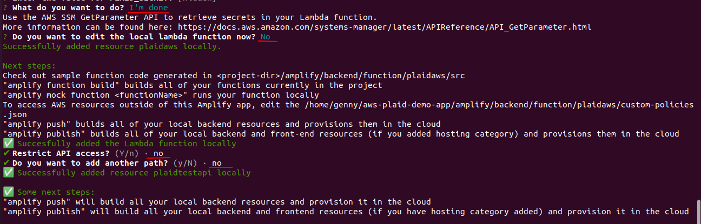
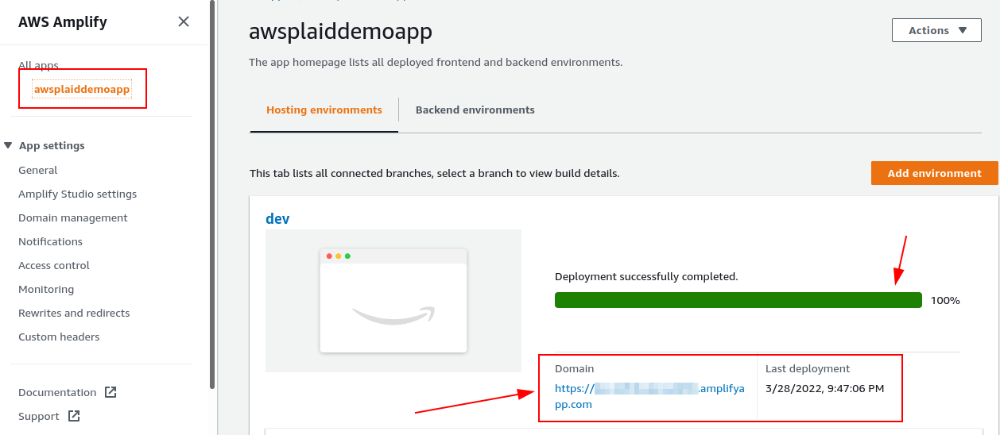

# Build-a-Fintech-App-on-AWS
Build a Fintech App on AWS Using the Plaid API


Open Finance initiatives have been gaining momentum across the world.

The fintech app providers are generally not banks, but they offer users a variety of convenient payment and finance features on smartphone apps. Users simply need to link the app to their bank and brokerage accounts, and grant the necessary permissions.

Fintech apps offer users benefits such as:

- Viewing balances across multiple bank accounts.
- Initiating payments to friends.
- Applying for loans without gathering and scanning bank and income statements.
- Paying for things online using a “Buy Now Pay Later” plan.
- Showing monthly income and expense categories to help set budgets.
- Displaying overall investment performance across multiple brokerage accounts.
- Buying crypto-assets.


In this project, I will show you how to build and deploy a basic fintech app on Amazon Web Services (AWS) in under an hour by using the **[Plaid Link API](https://plaid.com/docs/link/)**. This app allows users to sign up, log in, select their bank from a list, connect to that bank, and display the latest transactions.

### What is Plaid?

**[Plaid](https://plaid.com/)** is a San Francisco-based financial services company and [AWS Partner](https://partners.amazonaws.com/partners/0010h00001cBFNCAA4/Plaid) that helps fintech providers connect users safely to their bank accounts.

The Plaid Link acts as a secure proxy between a fintech app and a bank. It is currently able to connect to more than 12,000 banks and financial institutions throughout the world. It provides a single API to connect to them. 


### Architectural Design


### Building and Deploying the App


#### Prerequisites 

- Create a sandbox account at Plaid, and obtained an API keys. To achieve this, visit the Plaid website and then click Get API Keys.


- Install the Amplify CLI

The Amplify Command Line Interface (CLI) is a unified toolchain to create AWS cloud services for your app. Let's go ahead and install the Amplify CLI.

```
curl -sL https://aws-amplify.github.io/amplify-cli/install | bash && $SHELL
```


- Configure the Amplify CLI

To set up the Amplify CLI on my local machine, I have to configure it to connect to my AWS account. 

```
amplify configure
```

Amplify configure command will ask to sign into the AWS Console.


The following shows the new user permission credential:


### STEP 1:  Building the App

- Execute the following commands to clone the Plaid demo app from Github: 

```
git clone https://github.com/aws-samples/aws-plaid-demo-app.git 
```

```
cd aws-plaid-demo-app
```


- Next, begin the installation using the following command:

```
npm install
```


- Initialize a new Amplify project, by typing: 
```
amplify init
```

When prompted, Hit **Return/Enter** to accept the defaults.


- Add authentication

```
amplify add auth
```

When prompted, Hit **Return/Enter** to accept the defaults.


- Add the API:

```
amplify add api
```


When prompted for the **client_id**, it can found in the Plaid webpage dashboard that I previously created and logged in.


When prompted for the **PLAID_SECRET**, it can found in the Plaid webpage dashboard as follows:

**Note:** The Plaid_Secret will remain hidden when add it to the terminal.





- Copy the Lambda source file and install dependencies, using the following commands:

```
cp lambda/plaidaws/app.js amplify/backend/function/plaidaws/src/app.js
```
```
cd amplify/backend/function/plaidaws/src
```

```
npm i aws-sdk moment plaid@8.5.4
```


- Next, execute **push** with the following command:

```
amplify push
```


- Let's add a Database as follow


```
amplify add storage
```

When prompted, write the following highlighted words


- Update the Lambda function to add permissions for the database:


### STEP 2: Deploying the App

- Add hosting for the app:


- Deploy the app:

```
amplify publish
```


- Go to the URL displayed by the amplify publish command, and sign up as a new user. 




### STEP 3: Testing the App  

- After clicking on the website URL, create a new an account. Enter a username, password, email address and phone number. Be sure to check your email for the OTC (one time code) to verify your account.


### Final Thought

The walkthrough in this project demonstrates how easy it is to use AWS Amplify to create a secure, scalable, and completely serverless fintech app on AWS that allows users to sign up, select from among the 10,000 banks that Plaid Link connects to, and obtain the transaction history for a particular account.

